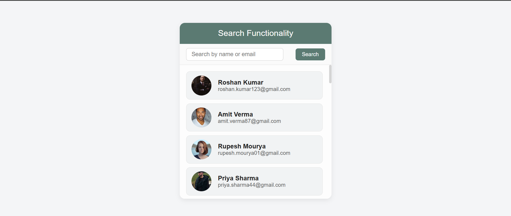
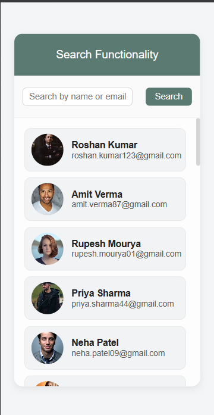

<h1 align="center">🔍 SmartSearch — User Finder App</h1>

  <b>A clean, responsive, and elegant <i>Search Functionality App</i> built using HTML, CSS, and JavaScript.</b> 
  Search users by their <b>name</b> or <b>email</b> in real-time using pure JS DOM manipulation.

---

## 🌐 Live Demo  
👉 **[View Live Project](https://roshan0011830.github.io/searchify/)**  

---

## 📸 Screenshots  

### 💻 Desktop View  

### 📱 Mobile View  

---

## 🧠 Features  

✨ **Real-time Search:** Instantly filters users as you type.  
🎨 **Responsive Design:** Works smoothly on mobile & desktop.  
⚡ **Pure JavaScript Logic:** No frameworks — just DOM power.  
📦 **Dynamic Rendering:** Creates UI directly from JS objects.  
🧾 **Reusable Data Structure:** Stores user info (image, name, email) in an array of objects.  

---

## 🧩 Tech Stack  

| 💻 Technology | 🔧 Purpose |
|----------------|------------|
| **HTML5** | Structure of the app |
| **CSS3** | Styling & responsiveness |
| **JavaScript (ES6)** | Logic, filtering, and DOM manipulation |

---

## ⚙️ Working Flow  

🧠 The logic is simple and efficient:

1. User data is stored inside an array (`usersArray`) with keys like `id`, `name`, `image`, and `email`.  
2. As the user types in the input box:
   - The `input` event triggers the `handleSearch()` function.  
   - It filters the array using `filter()` to match the text with **name** or **email** (case-insensitive).  
   - Matched users are rendered dynamically on the screen using template literals.  
3. Optional improvement: add a message like “No user found” when the search result is empty.  

---

## 💡 Code Example  

    function handleSearch(usersArray) {
      let searchText = inputField.value.toLowerCase();

      let filteredArray = usersArray.filter((item) =>
        item.name.toLowerCase().includes(searchText) ||
        item.email.toLowerCase().includes(searchText)
      );

      usersList.innerHTML = "";

      filteredArray.forEach((user) => {
        usersList.innerHTML += `
          

            

              
            

            

              <h3>${user.name}</h3>
              
${user.email}

            

          
`;
      });
    }

---

## 🎨 UI Design Overview  

🩶 **Theme:** Light, minimal, and clean grey-white combo.  
📱 **Responsive:** Fully adapts to both mobile and desktop.  
💫 **Layout:** Centered structure with user cards.  
📖 **Font:** Poppins / Sans-serif for a modern UI look.  

---

## 📲 Responsive Design Review  

This app is fully responsive and adapts beautifully to all screen sizes:

| Device | View |
|---------|------|
| 💻 **Desktop** | Full layout with search bar and scrollable user list |
| 📱 **Mobile** | Compact layout, readable text, and smooth scrolling |
| 🧭 **Tablet** | Perfectly balanced spacing and alignment |

---

## 🚀 How to Run Locally  

Follow these simple steps to set up the project on your local system 👇  

1. **Clone the repository**  
       git clone https://github.com/roshan0011830/SmartSearch.git

2. **Open the folder**  
       cd SmartSearch

3. **Run the project**  
   - Just open `index.html` in your browser  
   ✅ That’s it! Your SmartSearch app is ready to use locally 🎉  

---

## 👨‍💻 Author & Connect With Me  

**👨‍💻 Roshan Kumar**  
💼 Frontend Developer | HTML | CSS | JavaScript | React  

📬 **Let’s Connect:**  

  
  

---

## ⭐ Show Your Support  

If you liked this project —  
🌟 **Star this repository** and share it with others!  
Your support keeps me motivated to create and share more open-source projects 🚀  

---

## 🏷️ Tags  

`#HTML` `#CSS` `#JavaScript` `#SearchApp` `#MiniProject` `#Frontend` `#DOMManipulation` `#WebDevelopment` `#PortfolioProject`

---

> 🧭 *"Searchify — because clean code and smooth functionality never go out of style."*
